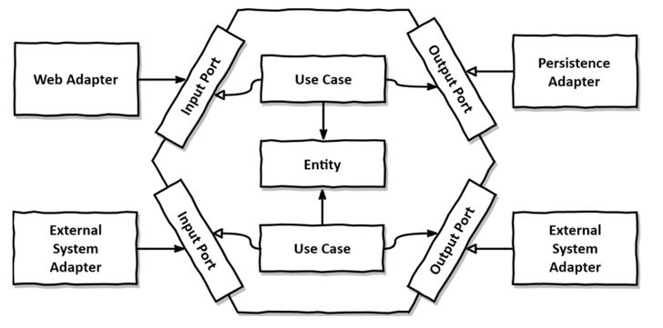
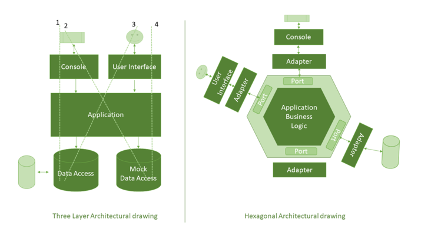

# Kotlin과 Spring Boot를 활용한 헥사고날 아키텍처

## 개요
Kotlin과 Spring Boot를 사용하여 헥사고날 아키텍처를 설계하고 구현하는 방법을 설명합니다. 헥사고날 아키텍처의 이점과 이를 구현하는 구체적인 방식을 단계별로 안내하여, 참석자들이 실무에서 바로 적용할 수 있도록 돕는 것을 목표로 합니다.

---

## 헥사고날 아키텍처란?
헥사고날 아키텍처(또는 포트와 어댑터 아키텍처)는 애플리케이션의 도메인 로직을 외부 의존성으로부터 분리하는 설계 방식입니다.

### 주요 개념
1. **도메인 중심 설계**
    - 비즈니스 로직은 외부 환경(예: 데이터베이스, API)과 독립적으로 설계됩니다.

2. **포트와 어댑터**
    - **포트(Ports)**: 애플리케이션과 외부 간의 인터페이스 정의
    - **어댑터(Adapters)**: 외부 시스템과의 통신을 구현한 클래스

3. **의존성 역전 원칙**
    - 도메인 계층이 외부 계층에 의존하지 않고, 외부 계층이 도메인 계층 인터페이스에 의존하도록 설계합니다.

---

## 구현 구조
헥사고날 아키텍처는 세 가지 주요 계층으로 구성됩니다:

### 1. 도메인 계층 (Core)
- 비즈니스 로직과 도메인 엔티티를 포함합니다.
- 외부 의존성이 없습니다.
- Kotlin의 데이터 클래스를 사용하여 간결하고 가독성 높은 코드를 작성합니다.

### 2. 애플리케이션 계층 (Application)
- 도메인 계층의 유즈 케이스(Use Case)를 실행합니다.
- 서비스 클래스 및 입력/출력 포트를 정의합니다.
- `@Service`와 같은 Spring 어노테이션으로 구성됩니다.

### 3. 인프라 계층 (Infrastructure)
- 데이터베이스, 외부 API, 메시징 시스템과 같은 외부 시스템과의 통신을 처리합니다.
- Spring Data JPA, RestTemplate 등을 활용합니다.

---

## 단계별 구현 방법

### 1. 프로젝트 설정
- Gradle 또는 Maven을 사용하여 Kotlin과 Spring Boot 프로젝트를 생성합니다.
- 필수 의존성 추가:
  ```kotlin
    // Spring Boot 기본 설정
    implementation("org.springframework.boot:spring-boot-starter-web")
    implementation("org.springframework.boot:spring-boot-starter-data-jpa")
    implementation("org.springframework.boot:spring-boot-starter-validation") // 데이터 검증

	// Kotlin 관련 설정
	implementation("com.fasterxml.jackson.module:jackson-module-kotlin") // JSON 파싱
	implementation("org.jetbrains.kotlin:kotlin-reflect")               // Kotlin 리플렉션
	implementation("org.jetbrains.kotlin:kotlin-stdlib")                // Kotlin 기본 라이브러리

	// 데이터베이스 설정
	runtimeOnly("com.h2database:h2")             // 인메모리 DB (개발 및 테스트용)

	// 로깅 설정
	implementation("org.springframework.boot:spring-boot-starter-logging")
	implementation("ch.qos.logback:logback-classic")

	// 개발 환경
	developmentOnly("org.springframework.boot:spring-boot-devtools") // 핫 리로드
    
  ```

### 2. 도메인 계층 설계
```kotlin
data class Order (
    val id: Long = 0,
    val name: String,
    val items: List<OrderItem>,
    val totalPrice: Double
)

data class OrderItem (
    val id: Long = 0,
    val name: String,
    val price: Double,
    val quantity: Int
)

```

### 3. 포트 설계
```kotlin
interface OrderRepositoryPort {
    fun save(order: Order): Order
    fun findAll(): List<Order>
    fun findById(id: Long): Order?
}

interface OrderUseCase {

    fun createOrder(order: Order): Order
    fun getAllOrders(): List<Order>
    fun getOrderById(id: Long): Order?

}
```

### 4. 애플리케이션 계층 설계
```kotlin
@Service
class OrderService (
    private val orderRepository: OrderRepositoryPort
) : OrderUseCase
{
    override fun createOrder(order: Order): Order {
        return orderRepository.save(order)
    }

    override fun getAllOrders(): List<Order> {
        return orderRepository.findAll()
    }

    override fun getOrderById(id: Long): Order? {
        return orderRepository.findById(id)
    }

}
```

### 5. 인프라 계층 구현
```kotlin
@RestController
@RequestMapping("/api/order")
class OrderControllerAdapter (
    private val orderUseCase: OrderUseCase
) {
    @PostMapping
    fun createOrder(@RequestBody orderRequest: OrderRequest): ResponseEntity<OrderResponse> {
        return ResponseEntity.ok(OrderResponse.toOrderResponse(orderUseCase.createOrder(orderRequest.toOrder())))
    }

    @GetMapping
    fun getAllOrders(): ResponseEntity<List<OrderResponse>> {
        return ResponseEntity.ok(orderUseCase.getAllOrders().map { OrderResponse.toOrderResponse(it) })
    }

    @GetMapping("/{id}")
    fun getOrderById(@PathVariable id: Long): ResponseEntity<OrderResponse> {
        return orderUseCase.getOrderById(id)?. let { ResponseEntity.ok(OrderResponse.toOrderResponse(it)) } ?: ResponseEntity.notFound().build()
    }
}


@Entity
@Table(name = "orders")
data class OrderEntity(
    @Id @GeneratedValue(strategy = GenerationType.IDENTITY)
    @Column(name = "order_id")
    val id: Long = 0,

    val name: String,
    val totalPrice: Double,

    @OneToMany(mappedBy = "order", cascade = [CascadeType.ALL], orphanRemoval = true)
    val items: MutableList<OrderItemEntity> = mutableListOf()
) {
    fun toDomain() = Order(
        id = id,
        name = name,
        totalPrice = totalPrice,
        items = items.map { it.toDomain() }
    )

    companion object {
        fun fromDomain(order: Order): OrderEntity {
            val orderEntity = OrderEntity(
                id = order.id,
                name = order.name,
                totalPrice = order.totalPrice
            )

            val items = order.items.map { OrderItemEntity.fromDomain(it, orderEntity) }

            orderEntity.items.addAll(items)

            return orderEntity
        }
    }
}

@Entity
@Table(name = "order_items")
data class OrderItemEntity(
    @Id @GeneratedValue(strategy = GenerationType.IDENTITY)
    val id: Long = 0,

    val name: String,
    val price: Double,
    val quantity: Int,

    @ManyToOne
    @JoinColumn(name = "order_id", nullable = false)
    val order: OrderEntity? = null
) {
    fun toDomain() = OrderItem(
        id = id,
        name = name,
        price = price,
        quantity = quantity
    )

    companion object {
        fun fromDomain(orderItem: OrderItem, order: OrderEntity) = OrderItemEntity(
            id = orderItem.id,
            name = orderItem.name,
            price = orderItem.price,
            quantity = orderItem.quantity,
            order = order
        )
    }
}

```

### 5. 테스트 작성
- JUnit과 Mockk를 사용하여 단위 테스트 작성
```kotlin
```

---

## 헥사고날 아키텍처의 장점
1. **유지보수성**: 도메인 로직과 외부 시스템 간의 강한 결합을 방지합니다.
2. **테스트 용이성**: 외부 의존성 없이 도메인 로직을 테스트할 수 있습니다.
3. **확장성**: 새로운 어댑터를 추가하여 시스템을 확장하기 쉽습니다.

---

## 헥사고날 아키텍처 





---

## 결론
Kotlin과 Spring Boot를 활용한 헥사고날 아키텍처는 가독성과 유지보수성을 모두 갖춘 설계를 가능하게 합니다.

