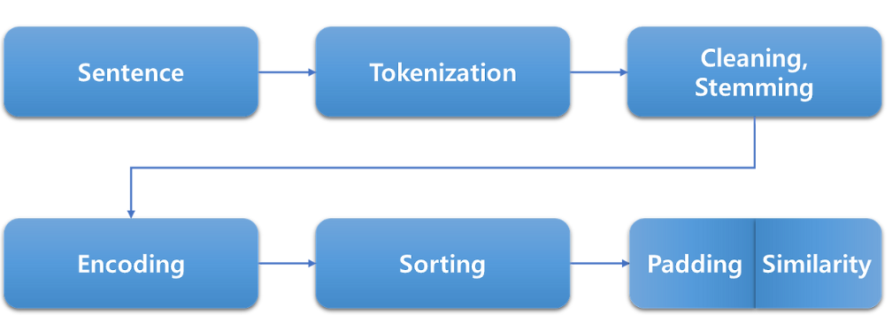

# LLM & RAG Learning Plan

LLM (Large Language Models) 및 RAG (Retrieval-Augmented Generation) 학습 및 실무 적용 플랜

---

## **1. 기초 다지기 (1~2주)**

### **1.1 LLM 기본 개념 학습**
- **목표:** LLM의 원리와 구조를 이해하고 대표적인 모델의 활용 사례를 학습.
- **내용:**
  - Transformer 구조 이해
  - 대표적인 LLM (GPT, BERT, LLaMA 등)의 차이점과 활용 사례
  - 파인튜닝과 프롬프트 엔지니어링 개념 학습
- **자료 추천:**
  - YouTube 강의: [What are Transformers?](https://www.youtube.com/watch?v=4Bdc55j80l8)
  - 블로그: Hugging Face Blog 및 OpenAI Blog
  - 논문: Attention is All You Need (Transformers 논문)

### **1.2 RAG 기본 개념 학습**
- **목표:** RAG의 구성 요소와 동작 방식을 이해.
- **내용:**
  - RAG의 동작 원리 (LLM + 검색 시스템 통합)
  - 벡터 데이터베이스 (e.g., Pinecone, Weaviate, Elasticsearch)
  - 인덱싱과 검색의 기본
- **자료 추천:**
  - 문서: [Pinecone Docs](https://www.pinecone.io/docs/)
  - GitHub 프로젝트: [RAG example with OpenAI](https://github.com/openai/retrieval-augmented-generation)

---

## **2. 실습 환경 구축 및 간단한 프로젝트 진행 (3~4주)**

### **2.1 개발 환경 구축**
- **목표:** 실습에 필요한 환경을 설정.
- **내용:**
  - Python 학습: 데이터 처리 및 모델 활용을 위해 기본 문법 학습
  - Hugging Face 라이브러리 활용
  - Docker 및 REST API 학습 (Java와의 연동 대비)
- **자료 추천:**
  - Python: [Real Python](https://realpython.com/)
  - Docker: [Docker 공식 튜토리얼](https://docs.docker.com/get-started/)
  - Hugging Face: [Transformers 튜토리얼](https://huggingface.co/transformers/)

### **2.2 간단한 프로젝트 진행**
- **목표:** RAG의 기본 동작을 이해하기 위한 간단한 예제 구현.
- **프로젝트 아이디어:**
  - 주제: “FAQ 챗봇 만들기”
  - 기술 스택: 
    - LLM: OpenAI API 또는 Hugging Face 모델
    - RAG: Elasticsearch 또는 Pinecone
    - 데이터: 회사의 FAQ 데이터를 JSON 형식으로 준비
- **단계:**
  1. FAQ 데이터를 벡터로 변환 (Hugging Face 또는 다른 임베딩 모델 사용)
  2. 검색 시스템 설정 (Elasticsearch/Pinecone)
  3. 간단한 REST API로 챗봇 구현 (Spring Boot)

---

## **3. 고급 학습 및 서비스 개발 (5~6주)**

### **3.1 LLM 커스터마이징**
- **목표:** 파인튜닝 및 커스터마이징 기술 학습.
- **내용:**
  - Hugging Face Datasets와 Trainer API 활용
  - Transfer Learning: 기존 모델에 새 데이터 추가 학습
- **프로젝트 아이디어:** 회사 데이터 기반으로 LLM 커스터마이징

### **3.2 RAG 고급 활용**
- **목표:** RAG를 통해 대규모 데이터를 효율적으로 처리.
- **내용:**
  - 실시간 데이터 업데이트
  - 대규모 검색 성능 최적화
- **프로젝트 아이디어:** 사용자 로그 데이터를 활용한 실시간 추천 시스템

---

## **4. 실무 적용 프로젝트 (7~8주)**

### **4.1 회사 요구사항 분석**
- LLM과 RAG가 필요한 실무 문제 도출
- 주요 활용 사례: 
  - 고객 지원 자동화
  - 내부 데이터 검색 최적화
  - 데이터 요약 및 통찰 제공

### **4.2 POC(Proof of Concept) 개발**
- **목표:** 실무 환경에서 작동 가능한 작은 단위의 프로젝트 진행.
- **예:** 회사 문서 관리 시스템과 통합된 지능형 검색 엔진 개발
- **기술 스택:**
  - Java-Spring Boot 기반 백엔드
  - LLM/RAG 통합 (Python 또는 API 연동)

---

## **5. 학습과 병행할 참고자료**
1. **책**
   - [Deep Learning with Python](https://www.manning.com/books/deep-learning-with-python)
   - [Generative AI with Python and TensorFlow 2](https://www.packtpub.com/product/generative-ai-with-python-and-tensorflow-2/9781800565788)
2. **온라인 강좌**
   - [Coursera: Natural Language Processing Specialization](https://www.coursera.org/specializations/natural-language-processing)
   - [FastAI NLP 강의](https://course.fast.ai/)

---

## **결론**
1. 기초 개념을 빠르게 습득하고 실습 중심으로 학습.
2. 간단한 프로젝트를 통해 RAG의 동작 원리를 이해.
3. 실무 환경에서 적용 가능한 서비스 개발로 학습 내용을 강화.

## **마인드 맵**


# LLM 스터디 커리큘럼

LLM(Large Language Models) 스터디 커리큘럼.

## **스터디 목표**
1. **LLM의 기본 개념 이해**: 언어 모델의 동작 원리와 주요 구성 요소를 학습합니다.
2. **주요 라이브러리 학습**: Hugging Face Transformers, OpenAI API 등을 활용하는 방법을 배웁니다.
3. **LLM 커스터마이징**: 파인튜닝 및 어댑터 학습(LoRA 등)을 경험합니다.
4. **실제 프로젝트 적용**: 챗봇, 텍스트 요약, 질의응답 시스템 등을 구현합니다.

---

## **커리큘럼 구성**

### **1주차: LLM 기본 개념 이해**
- **학습 주제**:
  - 자연어 처리(NLP) 기초: 토큰화, 임베딩, 언어 모델.
  - Transformer 아키텍처: Attention Mechanism, Encoder-Decoder 구조.
  - GPT와 BERT 모델 개념 비교.
- **활동**:
  - 논문 리뷰: "Attention is All You Need".
  - YouTube 강의 및 블로그 자료로 Transformer 동작 원리 학습.
- **실습**:
  - 간단한 NLP 예제 실습 (NLTK, SpaCy).

---

### **2주차: LLM 라이브러리 탐구**
- **학습 주제**:
  - Hugging Face Transformers 개요 및 설치.
  - OpenAI GPT API 활용법.
  - 모델 호출 및 간단한 텍스트 생성.
- **활동**:
  - Hugging Face 문서 탐색 및 주요 메서드 학습.
  - OpenAI API 키 생성 및 사용 설정.
- **실습**:
  - "Hello World" 텍스트 생성 코드 작성.
  - 주어진 텍스트를 입력하여 요약 또는 번역 수행.

---

### **3주차: 데이터 준비 및 모델 파인튜닝**
- **학습 주제**:
  - 데이터셋 구성 방법 (Custom Dataset).
  - Hugging Face Datasets 사용법.
  - 파인튜닝(Fine-tuning)과 LoRA 학습 방법.
- **활동**:
  - 공공 데이터셋 활용 (e.g., Common Crawl, 뉴스 기사).
  - 파인튜닝을 위한 적합한 데이터 선정 및 전처리.
- **실습**:
  - 사전 훈련된 GPT 모델을 활용해 파인튜닝 수행.
  - LoRA(저자원 어댑터 학습) 적용.

---

### **4주차: LLM 활용 프로젝트 기초**
- **학습 주제**:
  - 텍스트 생성 챗봇 제작.
  - 질의응답(Q&A) 시스템 구축.
  - 텍스트 분류/감정 분석 시스템.
- **활동**:
  - 간단한 Flask/Django API 설계.
  - 프론트엔드 연동 (React, Vue.js 등 선택 가능).
- **실습**:
  - 사전 학습된 LLM을 백엔드 서비스로 연동.
  - 사용자의 입력에 따라 맞춤형 응답 제공.

---

### **5주차: 최적화와 배포**
- **학습 주제**:
  - 모델 경량화 기술 (Distillation, Quantization).
  - GPU 활용 및 배포 최적화.
  - 클라우드 환경에서 배포 (AWS, GCP, Azure).
- **활동**:
  - 모델 사이즈 축소 실험.
  - Docker 컨테이너 생성 및 클라우드 배포.
- **실습**:
  - Hugging Face Inference API 활용.
  - FastAPI를 사용한 LLM 서비스 배포.

---

### **6주차: 고급 주제와 최신 트렌드**
- **학습 주제**:
  - 멀티모달 LLM (예: CLIP, Flamingo).
  - RLHF(강화 학습을 통한 인공지능 훈련).
  - Prompt Engineering 심화.
- **활동**:
  - 최신 연구 논문 및 GitHub 프로젝트 리뷰.
  - Prompt 실험 및 다양한 결과 비교.
- **실습**:
  - 멀티모달 입력 예제(텍스트+이미지) 구현.
  - 다양한 Prompt 전략 실험.

---

### **7~8주차: 팀별 프로젝트**
- **목표**:
  - 팀별로 아이디어를 선정하고 LLM을 활용한 프로젝트를 구현.
- **프로젝트 예시**:
  - AI 기반 고객 응대 챗봇.
  - 문서 요약 및 분석 시스템.
  - 소셜 미디어 감정 분석 툴.
- **성과물**:
  - 데모 발표 및 코드 리뷰.

---


# NLP

# 자연어 처리 (NLP) 소개

자연어는 우리가 일상생활에서 사용하는 언어이며, 자연어 처리는 컴퓨터가 자연어를 이해하고 처리할 수 있도록 하는 기술입니다. 이는 인공지능의 한 분야로서, 텍스트와 데이터를 처리하고 해석하는 데 머신러닝과 딥러닝을 주로 활용합니다. 자연어 처리는 음성 인식(Speech Recognition), 번역(Translation), 텍스트 요약(Text Summary), 텍스트 분류(Text Classification) 등 다양한 응용 분야에서 사용됩니다.

## 자연어 처리란?

NLP(Natural Language Processing)는 컴퓨터가 인간과 유사한 방식으로 텍스트와 음성 언어를 이해하는 능력을 부여하는 기술입니다. 이는 다음과 같은 주요 작업을 포함합니다:

- **자연어 인식 (Natural Language Understanding)**: 텍스트나 음성 데이터에서 구조와 의미를 이해합니다.
- **자연어 생성 (Natural Language Generation)**: 컴퓨터가 자연스러운 언어로 텍스트나 음성을 생성합니다.

NLP는 규칙 기반 전산 언어학, 통계적 머신러닝, 딥러닝 모델을 결합하여 컴퓨터가 텍스트와 음성 데이터를 효과적으로 처리할 수 있도록 돕습니다.

## 자연어 처리의 주요 기술

### 1. 감성 분석 (Sentiment Analysis)
- 텍스트의 감정이나 의견을 판별하는 기술.
- 긍정, 부정, 중립과 같은 감정을 식별하여 사용자의 피드백이나 질문에 적절히 응답.

### 2. 토큰화 (Tokenization)
- 텍스트를 최소 단위(토큰)로 분리하는 과정.
- 단어, 구두점, 문장 등 의미 있는 단위로 텍스트를 나눕니다.

### 3. 개체명 인식 (Named Entity Recognition)
- 텍스트에서 사람, 장소, 날짜, 조직 등 특정 유형의 개체를 식별.
- 중요한 정보를 추출하여 응답 구성 및 작업 수행에 활용.

### 4. 정규화 (Normalization)
- 텍스트를 표준화하여 일관된 형태로 변환.
- 대소문자 통일, 어간 추출, 표제어 추출 등 포함.

### 5. 의존성 구문 분석 (Dependency Parsing)
- 문장 내 단어들 간의 관계를 파악하여 문장의 구조를 분석.
- 사용자의 입력 문장을 이해하고 필요한 정보 추출.

## 주요 플랫폼과 NLP 기술 적용 사례

### Chatbot에 사용된 NLP 기술
- 감성 분석 (Sentiment Analysis)
- 토큰화 (Tokenization)
- 개체명 인식 (Named Entity Recognition)
- 정규화 (Normalization)
- 의존성 구문 분석 (Dependency Parsing)

### SIRI에 사용된 NLP 기술
- 특성 분석 (Feature Analysis)
- 언어 모델 (Language Model)
- 딥러닝 (Deep Learning)
- 히든 마르코프 모델 (HMM: Hidden Markov Model)
- 유사도 분석 (Similarity Analysis)

### 파파고에 사용된 NLP 기술
- 인코딩 (Encoding)
- 시계열 모델링 (Time Series Modeling)
- Attention Mechanism
- Self-Attention
- Transformer

## 주요 기술 상세 설명

### 감성 분석
- 텍스트에서 긍정, 부정, 중립 감정을 식별하여 적절한 대응 제공.

### 토큰화
- 사용자의 입력 데이터를 최소 단위로 분리하여 분석 수행.

### 개체명 인식
- 텍스트에서 사람, 장소, 날짜 등 중요한 정보를 추출.

### 정규화
- 일관된 데이터 처리와 오타 수정 등을 통해 텍스트의 표준화 수행.

### 의존성 구문 분석
- 문장 내 단어들 간의 관계를 파악하여 문맥 이해.

### 언어 모델
- 문장 구조와 단어 간 관계를 이해하여 자연스러운 응답 생성.

### 딥러닝
- 음성 인식, 언어 모델링, 문장 해석 등에서 복잡한 패턴과 의미 파악.

### 히든 마르코프 모델
- 시계열 데이터에서 상태 전이 확률을 모델링하여 음성 신호 해석.

### Transformer
- Attention Mechanism과 Self-Attention을 기반으로 언어 모델링과 번역 작업에 활용.

---

# 텍스트 전처리




# 텍스트 전처리 과정

텍스트 전처리는 자연어를 컴퓨터가 이해하고 처리할 수 있는 형태로 변환하는 과정입니다. 이를 통해 기계는 자연어를 이해하고, 인공지능은 텍스트 데이터를 학습할 수 있게 됩니다.

텍스트 전처리 과정은 다음과 같습니다:
1. Sentence
2. Tokenization
3. Cleaning
4. Stemming
5. Encoding
6. Sorting
7. Padding/Similarity

## 언어의 형태소

한글은 띄어쓰기가 되어 있지 않은데 함축적으로 들어 있는 내용과 파생 표현이 많기 때문에 토큰화를 진행하기가 어렵습니다. 그렇기 때문에 자연어를 효과적으로 처리할 수 있도록 전처리 과정이 필수적입니다.

### 예시 문장:
```
바쁜 일상 속에서도 책을 읽는 것은 마음의 휴식이 된다.
```

### 형태소 분석:
- "바쁜": 자립 형태소 (형용사)
- "일상": 자립 형태소 (명사)
- "속에서도": 의존 형태소 (조사)
- "책": 자립 형태소 (명사)
- "을": 의존 형태소 (조사)
- "읽": 자립 형태소 (동사 어간)
- "는": 의존 형태소 (관형사)
- "것": 자립 형태소 (명사)
- "은": 의존 형태소 (조사)
- "마음": 자립 형태소 (명사)
- "의": 의존 형태소 (조사)
- "휴식": 자립 형태소 (명사)
- "이": 의존 형태소 (관형사)
- "된다": 의존 형태소 (동사)

자립 형태소: 명사, 수사, 부사, 감탄사  
의존 형태소: 조사, 어미 어간

## 토큰화 (Tokenization)

토큰화는 텍스트를 의미 있는 최소 단위로 분리하는 과정으로, 문장을 단어 또는 형태소와 같은 의미 부여가 가능한 단위로 나누는 작업을 합니다.

문장 토큰화는 문장 단위로 의미를 나누는 것을 의미하며, 잘 사용하지 않습니다.

### 예시 문장:
```
The adventurous explorer discovered an ancient treasure hidden deep within the dense, mysterious jungle during a daring expedition.
```

### 토큰화 결과:
```
["The", "adventurous", "explorer", "discovered", "an", "ancient", "treasure", "hidden", "deep", "within", "the", "dense", "mysterious", "jungle", "during", "a", "daring", "expedition"]
```

### Treebank Tokenization (NLTK)
```python
# NLTK 설치
pip install nltk

# NLTK에서 Treebank Tokenization 모듈 가져오기
import nltk
from nltk.tokenize import TreebankWordTokenizer

# Treebank Tokenizer 객체 생성
tokenizer = TreebankWordTokenizer()

# 토큰화 수행
sentence = "Sample sentence for Tokenization."
tokens = tokenizer.tokenize(sentence)

# 결과 출력
print(tokens)
```

Treebank Tokenization은 NLTK 라이브러리의 `TreebankWordTokenizer` 모듈을 통해 사용할 수 있습니다. 이 토큰화 기법은 Penn Treebank 코퍼스에 기반하여 영어 문장을 토큰으로 분리하는 데 사용됩니다.

