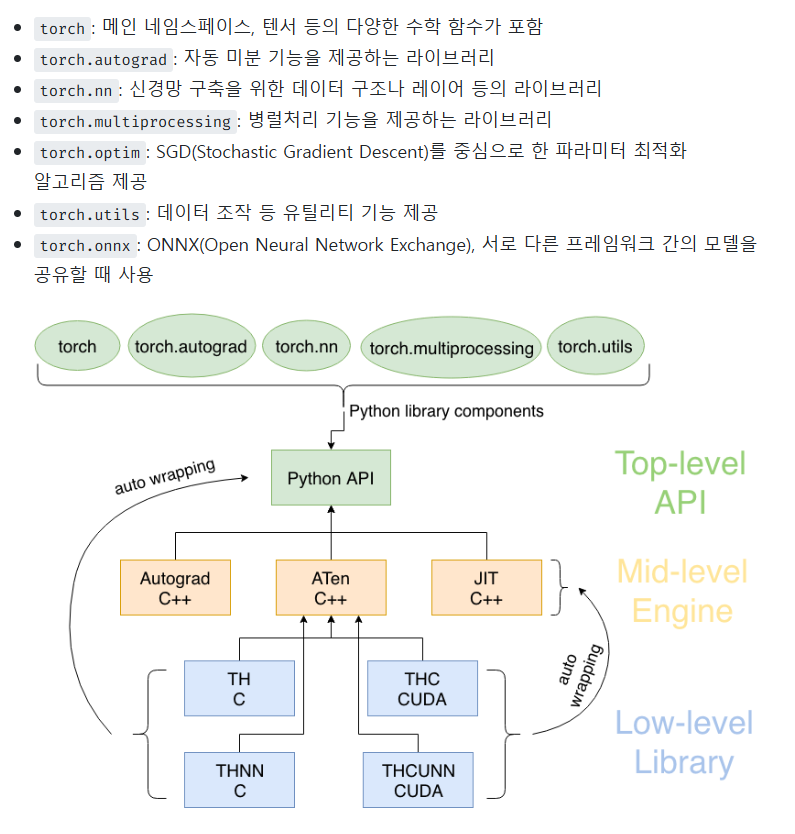
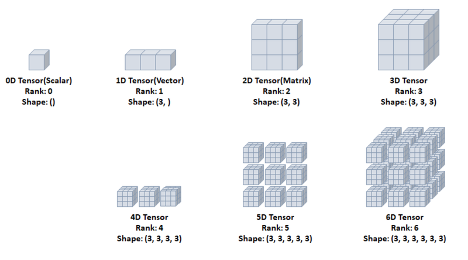

# PyTorch vs NumPy

## 1. 개요
**PyTorch**와 **NumPy**는 모두 수치 연산을 수행하는 라이브러리이지만, 주로 사용되는 목적과 기능이 다릅니다.

- **PyTorch**: 딥러닝 및 GPU 가속 연산을 위한 프레임워크
- **NumPy**: 과학 계산과 행렬 연산을 위한 라이브러리

---

## 2. 주요 차이점 비교

| 항목              | PyTorch                                  | NumPy                                   |
|------------------|---------------------------------------|----------------------------------------|
| **주요 목적**     | 딥러닝 및 머신러닝 모델 학습         | 수치 연산 및 행렬 연산                 |
| **기본 데이터 구조** | `torch.Tensor`                       | `numpy.ndarray`                        |
| **GPU 지원**      | GPU 가속 지원 (`.to(device)`)         | CPU 연산 전용                          |
| **자동 미분**     | `torch.autograd` 사용 가능           | 미분 기능 없음                         |
| **딥러닝 지원**   | 신경망 구축을 위한 `torch.nn` 제공   | 직접 구현 필요                         |
| **연산 속도**     | GPU 사용 시 빠름                     | CPU 연산만 가능                        |
| **NumPy 변환**   | `tensor.numpy()` 변환 가능           | `torch.from_numpy()` 변환 가능         |
| **사용 예시**     | 딥러닝, 신경망 학습, 이미지 처리      | 데이터 분석, 과학 계산, 통계 처리      |

---

## 3. 데이터 구조 차이
### PyTorch (`torch.Tensor`)
```python
import torch
x = torch.tensor([[1, 2], [3, 4]])
print(x)
```
- GPU에서 연산 가능: `x.to('cuda')`
- 미분 지원 가능: `x.requires_grad_()`

### NumPy (`numpy.ndarray`)
```python
import numpy as np
x = np.array([[1, 2], [3, 4]])
print(x)
```
- GPU 가속 불가능
- 미분 기능 없음

---

## 4. GPU 가속 차이
```python
# PyTorch (GPU 사용)
x = torch.tensor([1.0, 2.0, 3.0])
x = x.to('cuda')  # GPU에서 연산 가능
```
NumPy는 GPU를 지원하지 않으며, CPU에서만 연산 가능합니다.

---

## 5. 자동 미분 지원 (PyTorch 전용)
PyTorch는 `autograd`를 사용하여 자동 미분을 지원합니다.
```python
x = torch.tensor(2.0, requires_grad=True)
y = x ** 2

y.backward()
print(x.grad)  # dy/dx = 2x = 4
```
NumPy에서는 별도의 라이브러리를 사용해야 미분을 계산할 수 있습니다.

---

## 6. NumPy ↔ PyTorch 변환
PyTorch와 NumPy는 상호 변환이 가능합니다.

### PyTorch → NumPy
```python
tensor = torch.tensor([1.0, 2.0, 3.0])
numpy_array = tensor.numpy()
```

### NumPy → PyTorch
```python
numpy_array = np.array([1.0, 2.0, 3.0])
tensor = torch.from_numpy(numpy_array)
```

---

## 7. 결론
- **PyTorch**는 딥러닝과 머신러닝 모델 훈련에 최적화된 프레임워크로, **GPU 가속 및 자동 미분을 지원**합니다.
- **NumPy**는 과학 계산과 데이터 분석에 적합하며, **CPU 기반의 빠른 행렬 연산을 지원**하지만 딥러닝에는 적합하지 않습니다.

👉 **딥러닝을 할 경우 PyTorch를 사용하고, 데이터 분석이나 수치 계산이 필요할 때 NumPy를 사용하세요!**

---
## PyTorch 구조

---



---

# Tensor 개념 정리

---

## 1. Tensor란?
Tensor(텐서)는 데이터를 다차원 배열 형태로 표현하는 수학적 개념으로, 주로 머신 러닝과 딥 러닝에서 사용됩니다. Tensor는 확장된 벡터 및 행렬 개념으로 볼 수 있으며, 다양한 차원의 데이터를 표현하는 데 유용합니다.
---
## 2. Tensor의 차원(Dimension)
Tensor는 차원(또는 랭크, Rank)에 따라 다음과 같이 분류됩니다:

- **0차원 Tensor (Scalar, 스칼라)**: 단일 값을 가지는 텐서. 예) `5`, `3.14`
- **1차원 Tensor (Vector, 벡터)**: 숫자의 배열(리스트). 예) `[1, 2, 3]`
- **2차원 Tensor (Matrix, 행렬)**: 행과 열을 가지는 2차원 배열. 예)
  ```
  [[1, 2, 3],
   [4, 5, 6]]
  ```
- **3차원 Tensor**: 여러 개의 행렬을 포함하는 3D 배열. 예)
  ```
  [[[1, 2], [3, 4]],
   [[5, 6], [7, 8]]]
  ```
- **N차원 Tensor**: 3차원 이상 확장된 다차원 배열.
---
## 3. Tensor의 주요 연산
Tensor는 다양한 연산이 가능합니다:

- **덧셈 및 뺄셈**: 동일한 차원의 Tensor끼리 연산 가능
- **곱셈**: 행렬 곱셈 또는 요소별 곱셈(element-wise multiplication)
- **전치(Transpose)**: 행과 열을 교환하는 연산
- **Reshape**: Tensor의 형태를 변경
- **Indexing & Slicing**: 특정 요소를 선택하거나 부분을 추출
---
## 4. Tensor와 NumPy 비교
Tensor는 NumPy 배열과 유사하지만, 딥러닝 프레임워크(PyTorch, TensorFlow)에서는 GPU 연산을 지원하여 더욱 효율적인 연산이 가능합니다.

| 특징          | NumPy | Tensor |
|--------------|-------|--------|
| 다차원 배열   | O     | O      |
| GPU 가속     | X     | O      |
| 자동 미분 지원 | X     | O      |
| 딥러닝 활용   | 제한적 | 매우 활발 |
---
## 5. Tensor의 활용
Tensor는 주로 다음과 같은 분야에서 사용됩니다:

- **딥러닝 및 머신러닝**: 신경망 모델의 데이터 표현 및 연산
- **컴퓨터 비전**: 이미지 데이터 처리 (3D Tensor 활용)
- **자연어 처리(NLP)**: 단어 임베딩 및 시퀀스 데이터 표현
- **물리학 및 공학**: 다차원 데이터 모델링
---
## 6. Tensor 관련 라이브러리
Tensor를 다룰 수 있는 대표적인 라이브러리는 다음과 같습니다:

- **TensorFlow**: Google이 개발한 머신러닝 라이브러리
- **PyTorch**: Facebook이 개발한 동적 신경망 라이브러리
- **NumPy**: 기본적인 다차원 배열 연산 지원
---
## 7. 간단한 Tensor 코드 예제 (PyTorch)
```python
import torch

# 1D Tensor 생성
x = torch.tensor([1, 2, 3, 4])
print(x)

# 2D Tensor 생성
y = torch.tensor([[1, 2], [3, 4]])
print(y)

# Tensor 연산 (덧셈)
z = x + 2
print(z)
```
---
## 8. 결론

---

### Tensor는 머신러닝 및 딥러닝에서 핵심적인 데이터 표현 방식입니다. 다차원 배열 형태의 데이터를 효율적으로 표현하고 연산할 수 있어, 다양한 인공지능 응용 분야에서 활용되고 있습니다.

---

## Tensor


