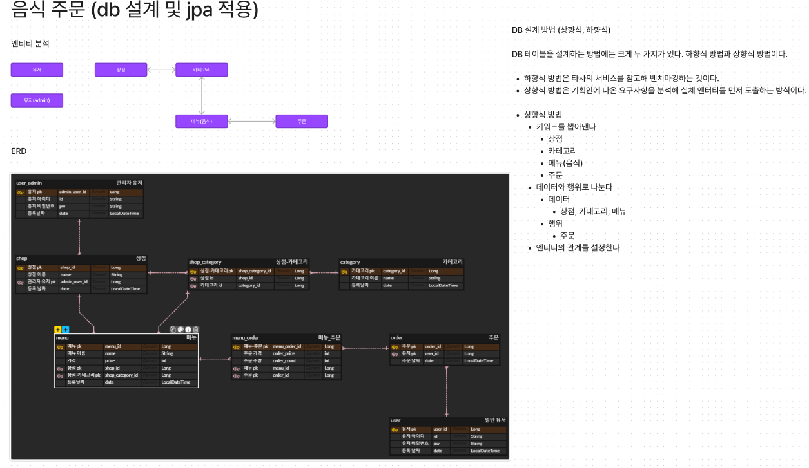

# DB 설계 및 JPA 적용 하기

## DB 설계 및 관계 설정 흐름도

> - 테이블 설계의 경우 상향식 설계 방식을 사용하여 설계 했습니다.

## JPA 적용

> JPA를 사용하면 객체를 데이터베이스에 저장하고 관리할 때, 개발자가 직접 sql을 작성하는 것이 아니라 JPA가 제공하는 API를 사용하면 된다.

### JPA
> - jpa는 java 진영의 orm 기술 표준이다.
> - ORM : 객체 관계 매핑, 객체와 관계형 데이터베이스를 orm 프레임워크가 중간에서 매핑
> - jpa는 application 과 jdbc 사이에서 동작한다.
> - 구현체 : 하이버네이트, eclipselink 등이 있다.

### 사용 이유
> - sql 중심적인 개발에서 객체 중심으로 개발
> - 생산성, 유지보수성에 좋다. -> 칼럼이 추가 되어도 entity만 수정하면 된다.
> - 패러다임의 불일치 해결 -> 상속, 연관관계, 객체 그래프 탐색, == 비교
> - 데이터 접근 추상화와 벤더 독립성

### EntityManagerFactory 
> - 엔티티 매니저 팩토리는 애플리케이션에서 한번만 생성하고 공유해서 사용해야 한다.

### EntityManager
> - 엔티티 매니저를 사용해서 엔티티를 데이터베이스에 crud 할 수있다.
> - 엔티티 매니저는 데이터베이스 커넥션과 밀접한 관계가 있으므로 스레드 간에 공유하거나 재사용 하면 안된다.
> - jpa를 사용하면 항상 트랜잭션 안에서 데이터를 변경해야 한다. 트랜잭션 없이 변경 할 경우 예외 발생

### 영속성 컨텍스트
> - entity를 영구 저장하는 환경이다.
> - 영속성 컨텍스트는 논리적인 개념이다.
> - 엔티티 매니저를 생성할 때 하나 만들어진다. -> 엔티티 매니저를 통해서 영속성 컨텍스트에 접근 N : 1 관계(스프링의 경우)
> - 생명주기
>> - 비영속 (new/transient) : 영속성 컨텍스트와 전혀 관계 없는 새로운 상태
>> - 영속 (managed) : 영속성 컨텍스트에 관리되는 상태
>> - 준영속 (detached) : 영속성 컨텍스트에 저장되었거나 분린된 상태
>> - 삭제 (removed) : 삭제된 상태
> - 특징
>> - 영속성 컨텍스트는 엔티티를 식별자(@id) 값으로 구분한다. 영속 상태는 식별자 값이 반드시 있어야 한다.
>> - 엔티티를 데이터베이스에 반영하는데 이것을 flush라고 한다.
>> - 장점
>>> - 1차캐시
>>> - 동일성 보장
>>> - 트랜잭션을 지원하는 쓰기 지연
>>> - 변경 감지
>>> - 지연 로딩
>> - 플러시 발생 case
>>> - em.flush() 직접 호출
>>> - 트랜잭션 커밋
>>> - jpql 쿼리 실행
>> - 준영속
>>> - 영속 -> 준영속
>>> - 영속 상태의 엔티티가 영속성 컨텍스트에서 분리
>>> - 영속성 컨텍스트가 제공하는 기능을 사용 못함
>>> - 식별자 값을 가지고 있다. (비영속 상태는 식별자 값이 없을 수 있지만 준영속은 영속이 되어진 후의 상태이므로 식별자 값을 가지고 있다.)
>>> - detach, clear, close로 상태 가능

### 엔티티 매핑
> - 객체와 테이블 매핑 : @Entity, @Table
> - 기본 키 매핑 : @Id
> - 필드와 컬럼 매핑 : @Column
> - 연관관계 매핑 : @ManyToOne, @JoinColum
> - Entity
>> - 기본 생성자는 필수다(public, protected 생성자)
>> - final 클래스, enum, interface, inner 클래스에는 사용할 수 없다.
>> - 저장할 필드에 final을 사용하면 안된다.
> - Table
>> - @Table은 엔티티와 매핑할 테이블을 지정한다. 생략하면 매핑한 엔티티 이름을 테이블 이름으로 사용한다.
> - 기본키 매핑
>> - identity, sequence, table 방식을 사용한다.

### 연관관계 매핑 기초
> - 객체 연관관계
>> - 객체간의 참조를 통해서 연관 관계를 설정한다. (단방향 관계) -> 참조
> - 테이블 연관 관계
>> - fk 를 사용하여 연관을 갖는다. (양방향 관계) -> 조인
> 방향 관계를 매핑할 때 둘 중 어떤 것을 사용해야 할지는 반대편 관계에 달려 있다.
> - ManyToOne
>> - fetch : 글로벌 페치 전략을 설정한다.
>> - cascade : 영속성 전이 기능을 사용한다.
> - JoinColumn
>> - 외래 키를 매핑할 때 사용한다.
>> - 속성
>>> - name : 매핑할 외래 키 이름(필드명)
> - 연관관계 사용
>> - 조회
>>> - 객체 그래프 탐색(객체 연관관계를 사용한 조회)
>>> - 객체지향 쿼리 사용(JPQL)
> - 연관관계의 주인
>> - 객체에는 양방향 연관관계라는 것이 없다.
>> - 서로 다른 단방향 연관관계 2개를 어플리케이션 로직으로 잘 묶어서 양방향인 것처럼 보이게 할 뿐이다.
>> - mappedBy로 연관 관계를 갖으면 읽기 밖에 하지 못한다(주인 아님)
>> - JoinColumn 있는 곳이 주인이다.
> - 양방향 연관관계의 주의점
>> - 양방향 연관관계를 설정시 주인에 값을 입력하지 않으면 데이터베이스에 데이터가 들어가지 않는다.
> #### 예시
>> * Order 클래스와 User 클래스 참조
>> * UserTest 참조

### 다양한 연관관계 매핑
> - 엔티티의 연관관계를 매핑 할 때 고려해야하는 3가지
>> - 다중성
>>> - ManyToOne
>>> - OneToMany
>>> - OneToOne
>>> - ManyToMany
>> - 단방향, 양방향
>>> - 테이블은 외래 키 하나로 조인을 사용해서 양방향으로 쿼리가 가능하지만 방향이라는 개념이 없다.
>>> - 객체는 참조용 필드를 가지고 있는 객체만 조회가 가능하다.
>> - 연관관계의 주인
>>> - 데이터베이스의 외래키를 관리하는 곳이 주인이다.
>>> - 주인이 아니면 mappedBy 속성을 사용하여 주인 필드 이름을 넣어야 한다.
>>> - 일대다 다대일의 경우 항상 다쪽에 외래키가 존재한다.
>> - ManyToMany를 사용하면 안되는 이유 -> JoinTable 방식으로 매핑 되어진다.(각 테이블의 Pk를 주로 사용 한 복합키 형식)
>>> - joinTable에 칼럼을 추가하면 해당 칼럼들을 사용할 수 없다.

### 고급 매핑
> - 상속 관계 매핑
>> - ORM 상속 관계 매핑은 객체의 상속 구조와 데이터베이스의 슈퍼타입, 서브타입 관계를 매핑하는 것이다.
>> - 