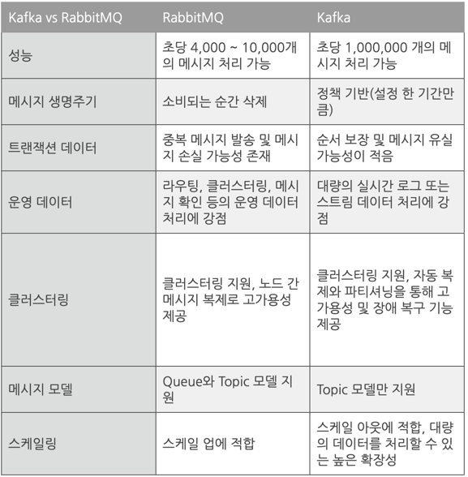

# kafka

### 메시지 브로커
> - 메시지 브로커는 메시지를 전달하는 서버이다. 
>   메시지 브로커는 메시지를 받아서 다른 시스템으로 전달하는 역할을 한다.

### 용어
> - Producer: 메시지를 생성하는 시스템
> - Consumer: 메시지를 소비하는 시스템
> - Topic: 메시지를 구분하는 단위
> - Broker: 메시지 브로커 서버
> - MessageQueue: 메시지를 저장하는 큐
> - Message: 데이터 단위
> - Partition: Topic을 나누어 저장하는 단위
> - zookeeper: kafka 클러스터의 메타데이터를 관리하는 서버
> - kafka client: kafka 브로커와 통신하는 클라이언트

### 메시지 브로커 장점
> - 실시간 데이터를 처리할 때 DB 에서 조회 하는 것보다 메시지 브로커를 이용하여 처리하는 것이 성능이 빠르다
> - DB의 경우 insert, select 를 동시에 하기에 퍼포먼스가 떨어짐에 비해 브로커는 빠르다.

### 메시지 브로커 단점
> - DB를 사용하는 경우 query를 이용하여 데이터 필터링이 가능하지만 메시지 브로커는 적재된 그대로 사용하므로 불가능하다.
> - 메시지를 장기간 보관 하기 위해선 추가적은 저장소가 필요하다.

## kafka
> - kafka는 아파치 소프트웨어 재단에서 만든 오픈소스 메시지 브로커 프로젝트이다.
> - 실시간으로 기록 스트림을 게시, 구독, 저장 및 처리할 수 있는 분산형 데이터 스트리밍 플랫폼이다.
> - kafka는 대용량의 데이터를 빠르게 처리할 수 있으며, 데이터를 안전하게 보관할 수 있다.

### RabbitMQ 차이
> - RabbitMQ는 전통적인 메시지 브로커이고, kafka는 이벤트 스트리밍 플랫폼이다.

